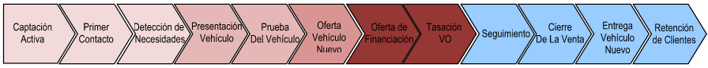

# El proceso de venta  
  
El **proceso de venta** es el flujo de tareas _tradicionalmente seguido por el vendedor_ para la venta de vehículos y en el que intervienen diferentes roles.  
  

  
  
  
  
El **proceso de venta** consta, conceptualmente, de tres etapas fundamentales:    
  
>**1.**  **Fase de Contacto**.  
>**2.** **Fase de Producto**.  
>**3.** **Fase de Seguimiento**  
>**4.** **Fase de Cierre de Venta**.  
  
# Fases del proceso de venta  
  
## Fase de Contacto      
  
La **Fase de Contacto** es el inicio del proceso de venta y se divide en:  
  
 - **Contacto Inicial**: Captación Activa, Primer Contacto.  
 - **Detección de Necesidades** del cliente.  
  
## Fase de Producto  
  
La **Fase de Producto** sitúa al vehículo en el centro del proceso de venta y se divide en:  
    
 - **Presentación del Vehículo**:  
>> - **Seleccionar vehículo** de stock o red.  
>> - Realizar **nueva configuración**.  
>> Seleccionar **Accesorios**, *Otros servicios** (garantías plus, etc.)  
 - **Planificación** y **Prueba del vehículo**.  
 - **Creación de la oferta**:  
>>  - **Envío de Oferta**: vehículos **VN**, **VO** y **DEMO**.  
>> - **Recogida de VO** y **Tasación**.  
>> - **Financiación**.  
  
## Fase de Seguimiento o Follow Up  
  
La **Fase de Seguimiento** o _Follow up_ precede al cierre del proceso de venta. Aquí realizaremos acciones de _consulta de la oferta enviada_, _temperatura del vehículo_, _feedback del cliente_.  
  
## Fase de Cierre de Venta    
  
La **Fase de Cierre de Venta** el la conclusión del proceso de venta. Según haya ido el seguimiento de la oferta, podemos encontrarnos con:  
  
 - **Venta existosa**: da lugar a la _Entrega del vehículo_ y posteriores acciones de _Retención de clientes_..  
 - **Venta perdida**.  
  

  

  

